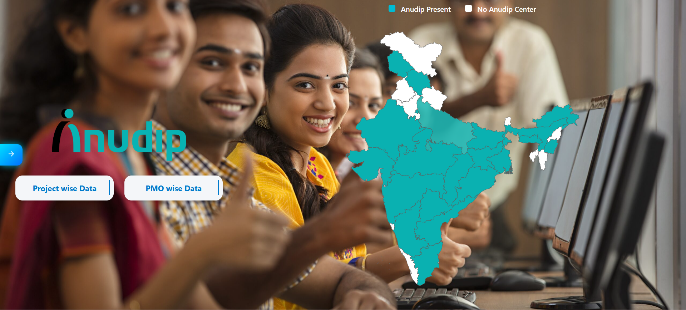
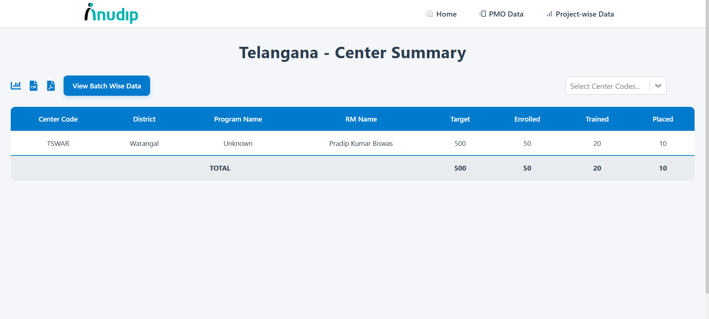
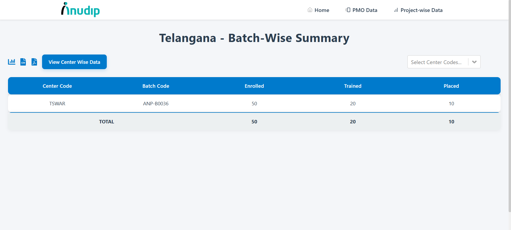
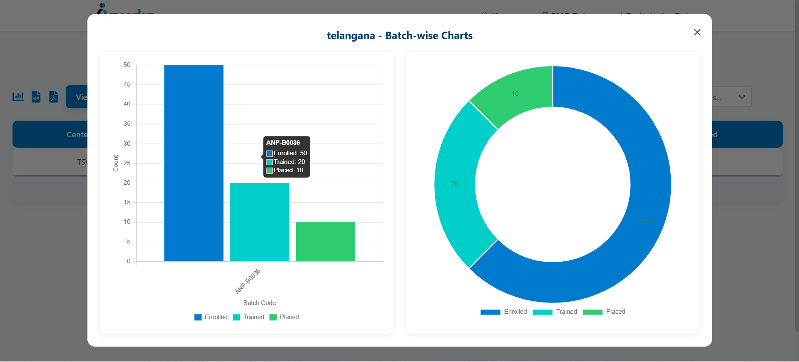
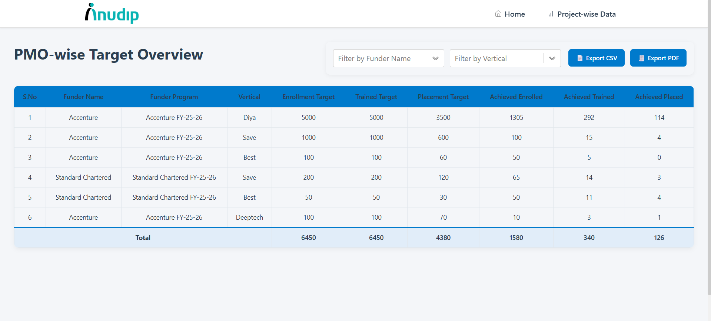
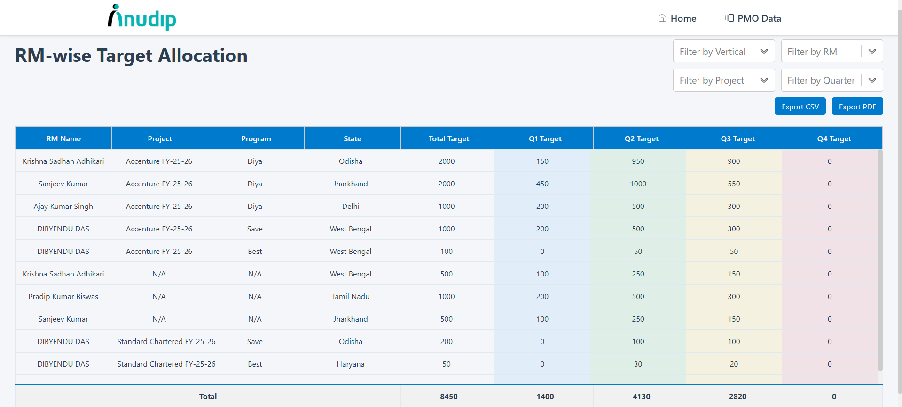

# PEARL - Placement, Enrollment and Analytics Reporting Layer

## 📌 Project Title & Description
**PEARL** is a data visualization and reporting tool built for the **Anudip Foundation**. It enables real-time tracking of training and placement metrics across various states, centers, and education projects like Diya, DeepTech, and SAVE. The dashboard provides actionable insights for stakeholders at different levels—PMO, GM, RM, and Center Managers.

---

## 👥 Team Details
- **Team Name**: SIG (Special Intelligence Group)

| Name                | Role                 | Email                          |
|---------------------|----------------------|---------------------------------|
| Guru Prasad Behera | Full Stack Developer | guru.behera@anudip.com   |
| Mupan Pruthvi       | -      | mupan.pruthvi@anudip.org            |
| Guttula Ravi Teja       | -      | guttula.teja@anudip.org            |


---

## 🧑‍💻 Tech Stack
**Frontend**: React.js, Chart.js, React Router Dom  
**Backend**: Node.js, Express.js, Nodemon, Dotenv, Json2csv, pdfkit, Cors   
**Database**: MySQL  
**Other Tools**: Postman, GitHub, Google Drive

---

## 📖 Project Description
PEARL is designed to:
- Track enrollment, training, placement, and dropout metrics
- Visualize data through maps, modals, and charts
- Enable filtering by quarter, project, RM, GM, and center
- Support decision-making with real-time SQL-backed data

The system uses dynamic routing, REST APIs, and deep integration with backend data sources to serve state-wise, project-wise, and center-wise performance.

---

## ⚙️ Setup Instructions
```bash
# Clone the repository
git clone https://github.com/Guruprasad3n/Anudip-Foundation
cd Anudip-Foundation

# Start backend
cd server
npm install
npm start

# Start frontend
cd frontend
npm install
npm run dev
```

Ensure that your MySQL server is running and credentials are correctly set in `server/db.js`.

- DB_HOST = `Host Name`
- DB_USER= `User Name`
- DB_PASSWORD = `Your Password`
- DB_NAME = `Your DB Name`
- PORT= `Your Port Number`

---

## 🚀 Usage Guide
1. Launch the app locally
2. Start from the **Home Page** featuring the India map
3. Click a state to view center-wise data
4. Use the chart icons to open performance modals
5. Navigate to **Project-wise View** to see RM-wise allocations
6. View **Batch-wise Reports** for individual centers

### 🔍 Screenshots
*(App screenshots here)*







---

## 🔗 API Endpoints / Architecture
### Key API Endpoints
- `GET /api/state/:stateName/centers` – Fetch centers under a selected state
- `GET /api/projects` – Get all project assignments for RMs
- `GET /api/center/:centerCode/batches` – Fetch batch-level performance

### Architecture
- Data flows from SQL tables: `planner_program_planning`, `planner_program_planning_gm`, `planner_program_planning_rm`, `planner_target_gm_rm`, and `batches`
- Backend processes hierarchical data and serves it via REST API
- React frontend consumes these APIs and renders dynamic visualizations

---

## 📝 License
This project is open for educational and demonstration purposes. No formal license applied.

<!-- ---

## 📽️ Demo Video
👉 [Click here to view the demo video](https://drive.google.com/your-demo-video-link)  
*(Ensure access is set to: "Anyone with the link can view")* -->

---

## 🙌 Acknowledgements

Built with ❤️ for Anudip Foundation, to support skill development and training initiatives across India.

---

## 📧 Contact 


## 📤 Submission Checklist
- [x] GitHub public repository created
- [x] README.md file added
- [x] All project source code included
- [x] Demo video uploaded to Google Drive
- [x] GitHub link and video shared with Poulomi Roy, CC: Debdas Mondal & Pritam Basu

Let the best ideas win! 🚀


<!-- # Anudip Foundation - Training & Mobilization Dashboard


## 🌐 Project Overview

This project is a comprehensive educational dashboard built for the Anudip Foundation. The primary goal is to visually manage, monitor, and track the progress of students across various training centers in India. It integrates interactive maps, batch-level data, mobilization tracking, and chart-based analytics.

## 1. 🗺️ Interactive India Map
 - SVG-based clickable map of India.
 - On hovering a state, it highlights and displays the state name.
 - On clicking, navigates to a page with center-level student data for that state

## 2. 📊 State-wise & Batch-wise Data Pages
 - StatePage: Displays center-wise summary data.

 - StateBatchWiseData: Visualizes batch-wise data for students using Chart.js.

 - Filtering available by center codes and batches.

 - Charts (Bar, Pie, PolarArea) open in modal views for deeper analysis.
## 3. 🖼️ Mobilization Gallery
 - Modal-based form for employees to upload mobilization effort details.
 - Fields include:
     - Employee ID
     - State selection (dynamically sourced from data.js based on "Center State")
     - Image upload
     - Description message
 - Data is temporarily stored in localStorage.
 - Uploaded entries are displayed as cards in a gallery grid with images and text.
## 🛠️ Tech Stack

- Frontend
  - React.js
  - React Router DOM (for routing)
  - Chart.js (data visualization)
  - HTML5 / CSS3
  - JavaScript (ES6+)
- Backend
  - Node Js
  - Express Js
  - MySQL
  - Nodemon
  - PDF Kit
  - Json2Csv

## 🧪 How to Run Locally
   
    # Clone the repo
    git clone https://github.com/Guruprasad3n/Anaudip-Foundation
     
    # Go to the folder
    cd anudip-dashboard

    # Install dependencies
    npm install
    # Run the development server
    npm run dev

   
## 🙌 Acknowledgements

Built with ❤️ for Anudip Foundation, to support skill development and training initiatives across India.


# 📧 Contact -->
